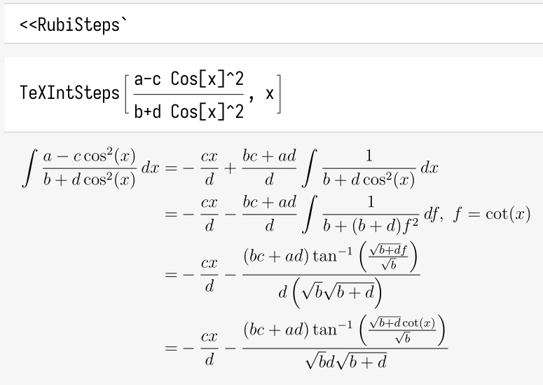

# Rubi Steps

Enhancement for Rubi steps.

## New Paclet

### Installation

Evaluate the following in Wolfram kernel to install:

`PacletInstall["RubiSteps", "Site" -> "https://github.com/asdasd1dsadsa/RubiSteps/raw/master"]`

**If** not having a good Internet, try to get the latest paclet file from [here](/Paclets/), and then evaluate:

`PacletInstall["the/path/to/the/file.paclet"]`

### Documentation

* Search `RubiSteps` in the documentation center of Mathematica.
* Web docs hosted by Github pages: https://asdasd1dsadsa.github.io/RubiSteps

* Use `Information` to see usage messages.

### Note

* Perhaps I won't update this too, but at least I intend to.

* Function usage changed. Not same to the old-fashion one.

* Requires Wolfram Kernel with 12.2+ version.

## Old-fashion package file

### Installation

You can execute [this script](/Package/Install.wls) to install [the package file](/Package/RubiSteps.wl), manually also OK.

### Documentation

[Documentation(Old ver)](/Package/README.MD)

### Note

* No longer maintained.

---

## To Do

* Parentheses for preventing $ax+bx^2--cx^3$ 。
* Support definite integrals.
